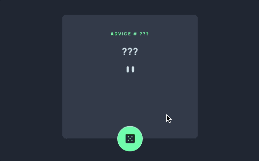

# Frontend Mentor - Advice generator app solution

This is a solution to the [Advice generator app challenge on Frontend Mentor](https://www.frontendmentor.io/challenges/advice-generator-app-QdUG-13db). Frontend Mentor challenges help you improve your coding skills by building realistic projects.

## Table of contents

- [Overview](#overview)
  - [The challenge](#the-challenge)
  - [Preview](#preview)
  - [Links](#links)
  - [Built with](#built-with)
  - [What I learned](#what-i-learned)
  - [Continued development](#continued-development)
  - [Useful resources](#useful-resources)
- [Author](#author)

## Overview

### The challenge

Users should be able to:

- View the optimal layout for the app depending on their device's screen size
- See hover states for all interactive elements on the page
- Generate a new piece of advice by clicking the dice icon

### Preview



### Links

- Solution URL: [Add solution URL here](https://your-solution-url.com)
- Live Site URL: [Add live site URL here](https://your-live-site-url.com)

## My process

### Built with

- Flexbox
- Mobile-first workflow
- [React](https://reactjs.org/) - JS library

### What I learned

In this project I got the opportunity to use what I have been studying about React and put my skills to the test on how to work with function components, import and export them, writing markup with JSX, using JavaScript in JSX with curly braces, passing props to components and a little bit about hooks.

```js
function ContentWrapper () {
    const [idResult, setIdResult] = useState('???');
    const [quoteResult, setQuoteResult] = useState ('???');
    
        async function fetchHandler () {
        const APIresponse = await fetch('https://api.adviceslip.com/advice');
        const data = await APIresponse.json();
        
        setIdResult(data.slip.id);
        setQuoteResult(data.slip.advice);
    } 

    return (
        <div className='content-wrapper'>
            <AdviceId advice={idResult} />
            <Quote quote={quoteResult} />
            <PatternDivider />
            <Botao onPress={fetchHandler}/>
        </div> 
    )
}
```

### Continued development

There is a lot more about React that I need to tackle, such as hooks, adding interactivity and state management.

### Useful resources

- [React: desenvolvendo com JavaScript](https://cursos.alura.com.br/course/react-desenvolvendo-javascript) - This was the course that gave me the base to develop this little advice generator. 

   Alura is a Brazilian tech school that produces amazing content, so if Portuguese is your native language, go check it out.
- [ReactJS Documentation](https://beta.reactjs.org/learn) - The React documentation is very well written and their examples are the best it helped me a lot! 

   At the end of every chapter, there is a challenge section where you can put your knowledge to the test and help reinforce what you have learned. 

## Author

- Website - [Add your name here](https://www.your-site.com)
- Frontend Mentor - [@yourusername](https://www.frontendmentor.io/profile/yourusername)
